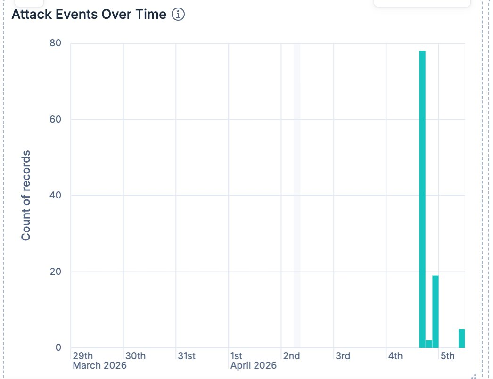
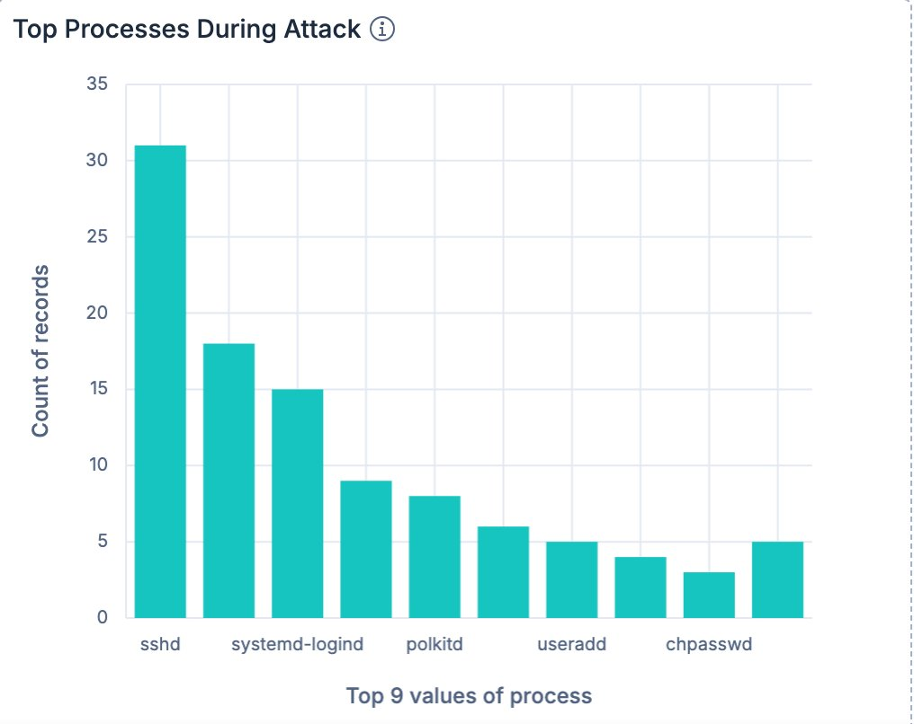
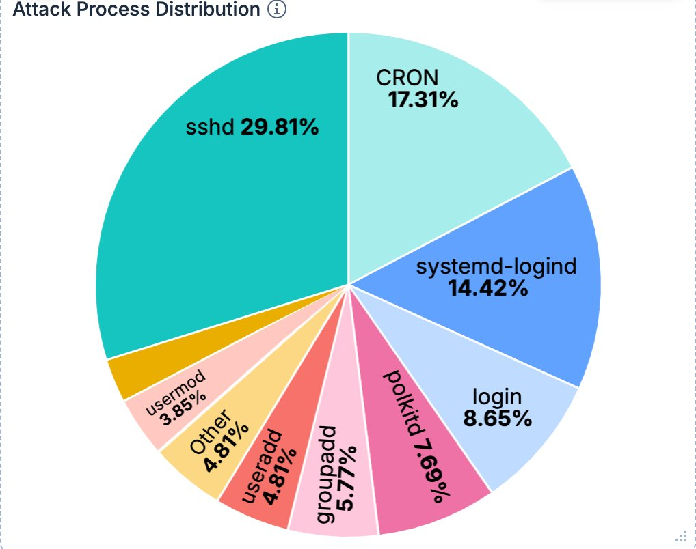
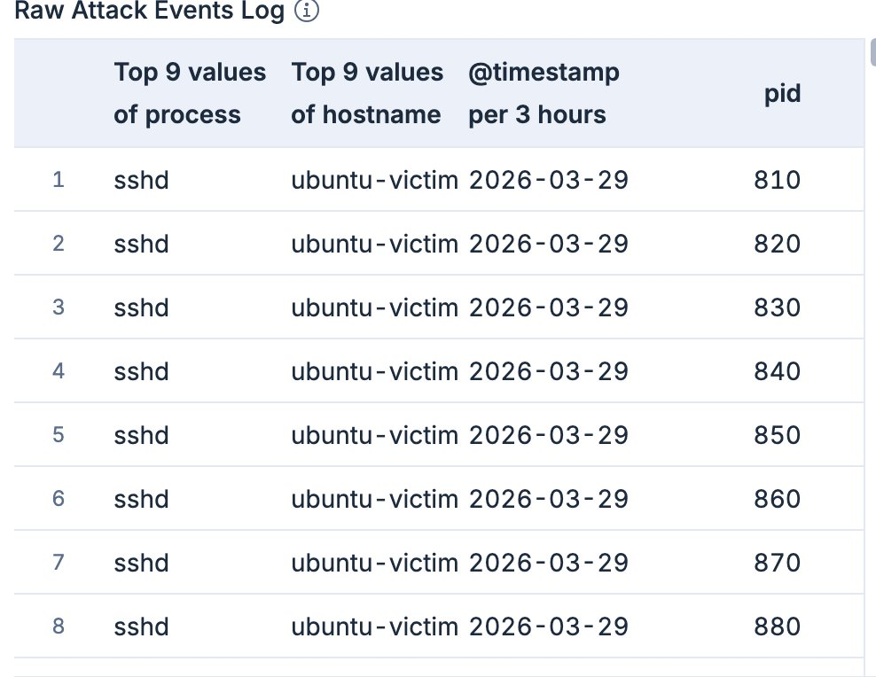

# 🔵 Phase 2 — Blue Team Detection & Investigation

## Overview
Attack logs from Phase 1 collected, converted to CSV, and ingested into Elastic Cloud SIEM. Built 4-panel Kibana detection dashboard identifying the complete attack chain.

**SIEM Platform:** Elastic Cloud (Serverless Security)  
**Index:** apt-attack-logs  
**Total Records:** 104 events  
**Detection Date:** April 5, 2026  

---

## Log Collection

```bash
# On victim machine
sudo cat /var/log/auth.log > /tmp/auth_attack.log
wc -l /tmp/auth_attack.log   # 151 lines

# Transfer to Kali
scp admin@172.16.207.4:/tmp/auth_attack.log ~/auth_attack.log

# Convert to CSV
python3 -c "
import re, csv
with open('/root/auth_attack.log') as f:
    lines = f.readlines()
rows = []
for line in lines:
    m = re.match(r'(\S+)\s+(\S+)\s+(\S+)\[(\d+)\]:\s+(.*)', line)
    if m:
        rows.append([m.group(1), m.group(2), m.group(3), m.group(4), m.group(5).strip()])
with open('/root/auth_attack.csv', 'w', newline='') as f:
    w = csv.writer(f)
    w.writerow(['timestamp','hostname','process','pid','message'])
    w.writerows(rows)
print(f'Done: {len(rows)} rows')
"
```

---

## Dashboard Panels

### Panel 1 — Attack Events Over Time
Timeline showing 78-event spike on April 4, 2026 — confirms coordinated attack.



---

### Panel 2 — Top Processes During Attack
sshd dominates (31 events) confirming brute-force. useradd/usermod confirm backdoor.



---

### Panel 3 — Attack Process Distribution
sshd 29.81% + account tools 14.43% = clear attack pattern.



---

### Panel 4 — Raw Events Log
104 events with process, hostname, timestamp, PID for forensic timeline.



---

## Indicators of Compromise

| IoC Type | Value | MITRE |
|----------|-------|-------|
| Attacker IP | 172.16.207.3 | T1110 |
| Username | admin (brute-forced) | T1078 |
| Process | useradd backdoor | T1136 |
| Account | backdoor (uid=1002) | T1136.001 |
| Sudo entry | NOPASSWD:ALL | T1548.003 |
| Exfil port | 8888 | T1048 |
| File | stolen_data.tar.gz | T1560 |

---

## Attack Timeline Reconstructed

| Time UTC | Event | Process |
|----------|-------|---------|
| 12:21:10 | 3x Failed SSH attempts | sshd |
| 12:23:09 | SSH login accepted | sshd |
| 12:24:32 | sudo su → root | sudo |
| 12:27:43 | backdoor user created | useradd |
| 12:28:20 | backdoor added to sudo | usermod |
| 12:31+ | Data exfiltration | python3 |

---

## KQL Queries for Threat Hunting

```
# Detect brute-force
process: "sshd" AND message: *Failed*

# Detect privilege escalation  
process: "sudo" AND message: *root*

# Detect backdoor creation
process: "useradd" OR process: "usermod"

# Detect exfiltration
process: "python3" AND message: *http.server*
```
